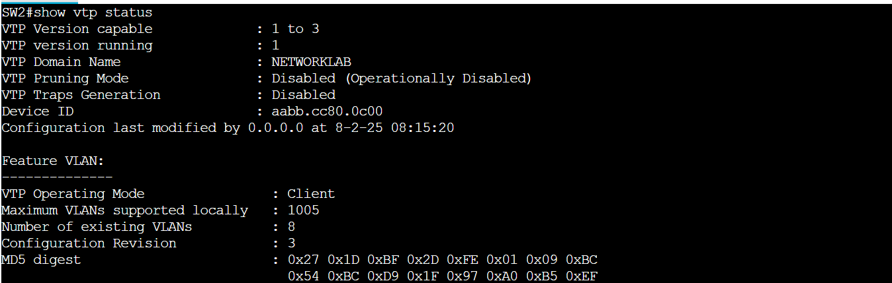
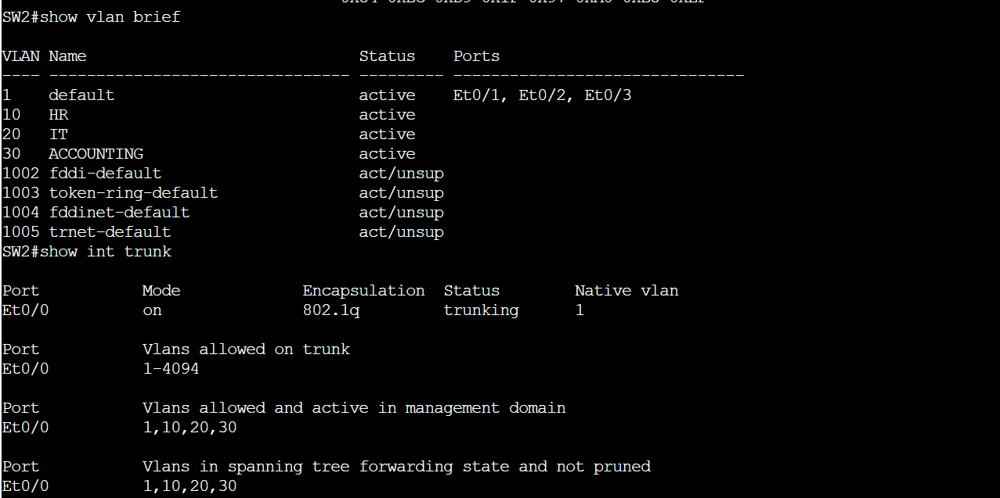
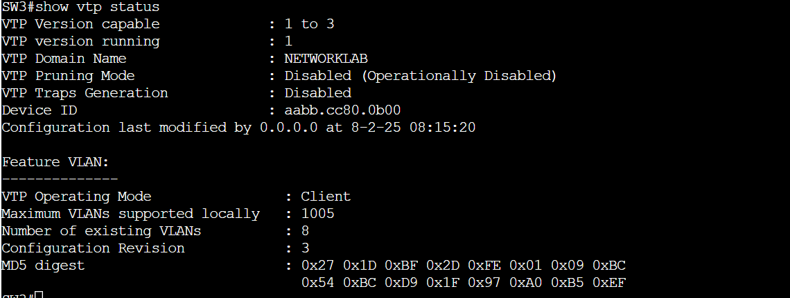
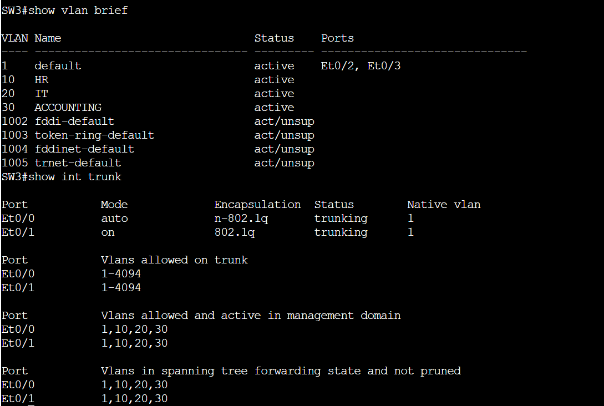
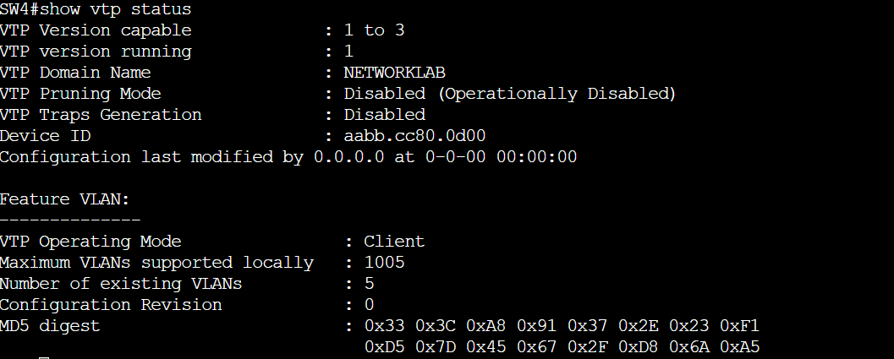
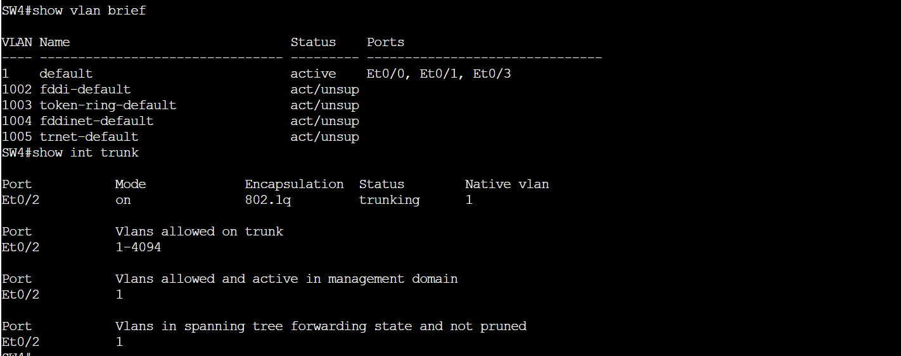

# VTP
# 📊 Project Overview

This project demonstrates the configuration and troubleshooting of VTP (VLAN Trunking Protocol) in a simulated network of 5 Layer 2 switches using Cisco CML (Cisco Modeling Labs). The focus is on identifying and resolving a VTP password mismatch issue.  

# 🖧 Topology 

# SW1 (Server):

 # SW2 (Client):

# SW3 (Client):

# SW4 (Client):

# SW5 Was configured in transparent mode

# SW2 Checking configuration 

 # SW3 Checking configuration 

# SW4 Checking configuration 

# ⚠️ Problem Description

After all switches were configured and connected, SW4 failed to learn VLANs from the VTP server, while SW2 and SW3 learned them successfully.

Symptoms observed on SW4:

show vlan brief only displayed VLAN 1

show vtp status showed:

Domain Name: NETWORKLAB (correct)

Operating Mode: Client

Configuration Revision: 0

VTP trunk connection to SW1 was up 

# 🔎 Root Cause Analysis

The likely causes for VTP sync failure include:

Mismatched domain name ❌ (not the case)

Trunk not configured properly ❌ (verified as correct)

Mismatched VTP version ❌ (default v1 used throughout)

Incorrect VTP password ✅

# Why it was the password:

Other clients (SW2 and SW3) with the same config worked fine

SW4 had the same domain name and mode

Only difference was the password cisco12

Once corrected to cisco123, VLANs propagated and Configuration Revision increased > 0

# 📅 Lessons Learned

VTP password mismatches are invisible by default, but detectable through indirect signs:

Revision number stuck at 0

VLANs missing

VTP domain matches

Always document and verify VTP passwords in production environments

Use vtp transparent mode when possible to reduce risk of unwanted VLAN propagation
