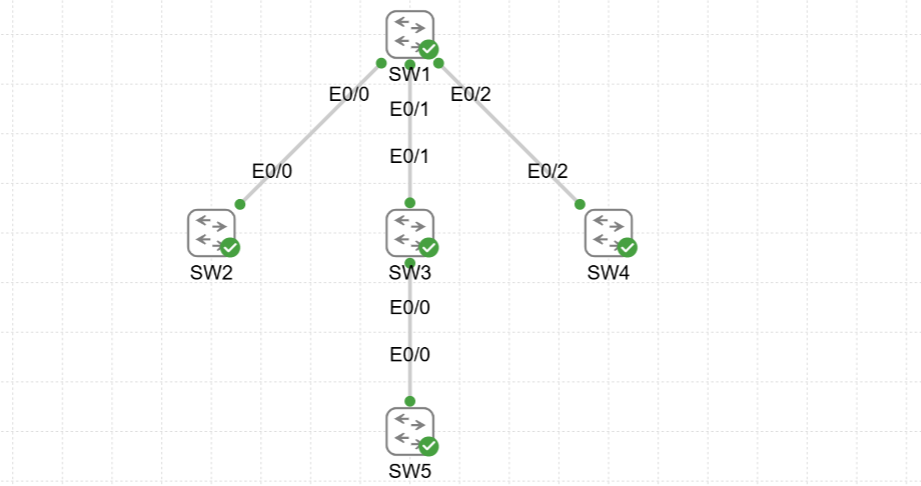
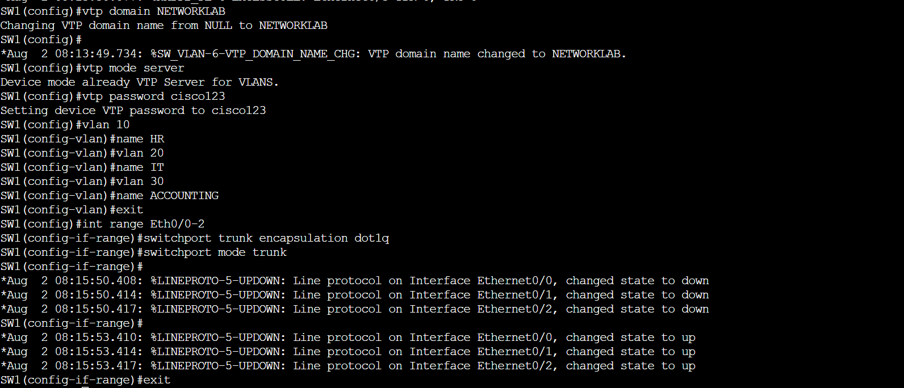
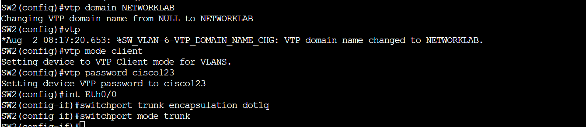
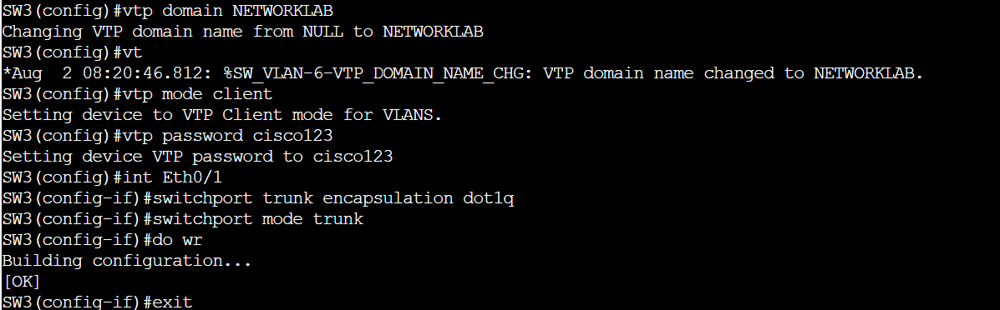
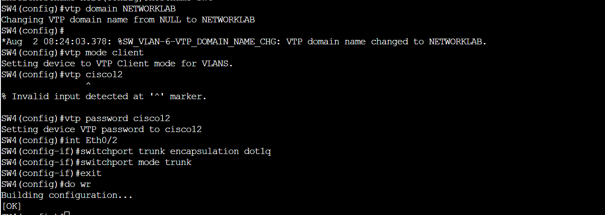

# VTP
# 📊 Project Overview

This project demonstrates the configuration and troubleshooting of VTP (VLAN Trunking Protocol) in a simulated network of 5 Layer 2 switches using Cisco CML (Cisco Modeling Labs). The focus is on identifying and resolving a VTP password mismatch issue.  

# 🖧 Topology 

# SW1 (Server):

 # SW2 (Client):

# SW3 (Client):

# SW4 (Client):

# SW5 Was configured in transparent mode
